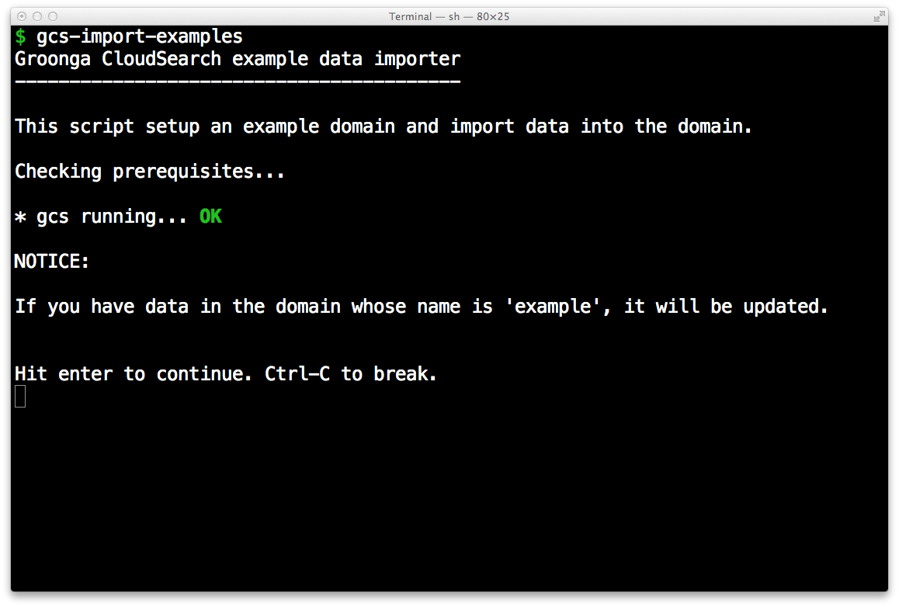
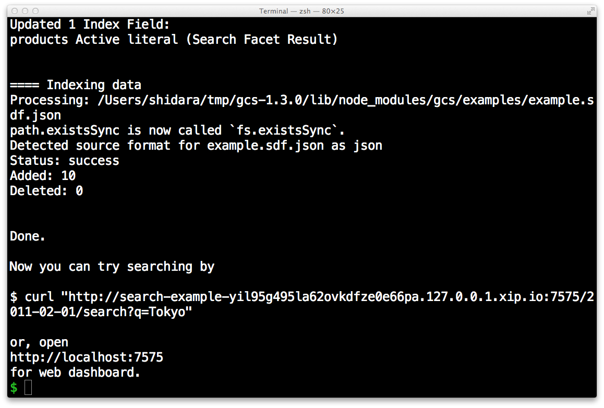

# Tutorial

This document describes how to use Groonga CloudSearch step by
step. The goal of this document is that you understand how to use
Amazon CloudSearch compatible API and you can develop your application
with Groonga CloudSearch. You don't need Amazon CloudSearch API
related knowledge. This document describes it.

This document doesn't describe Amazon CloudSearch specific topics such
as how to start Amazon CloudSearch service and how much payment will
be caused for your application. See [Amazon CloudSearch
page](http://aws.amazon.com/cloudsearch/) about them.

 * [Summary](#summary)
 * [Prepare test environment](#prepare_test_environment)
   * [Install Groonga CloudSearch](#install_groonga_cloudsearch)
   * [About search domain and endpoints](#about_search_domain_and_endpoints)
   * [Start Groonga CloudSearch server](#start_groonga_cloudsearch_server)
   * [Import example documents](#import_example_documents)
 * [How to search documents](#how-to-search-documents)
   
   * [Restrictions](#restrictions)
 * [How to register documents](#how-to-register-documents)
   * [Command line tools](#command-line-tools)
   * [Creating search domain API](#creating_search_domain_api)
   * [Defining index field API](#defining_index_field_api)
   * [Registering documents API](#registering_documents_api)
 * [How to register documents via HTTP](#how-to-register-documents-via-http)
   * [Configuration API](#configuration_api)
   * [Creating search domain API](#creating_search_domain_api)
   * [Defining index field API](#defining_index_field_api)
   * [Registering documents API](#registering_documents_api)
 * [Next step](#next_step)

## Summary

Groonga CloudSearch is an Amazon CloudSearch compatible open source
full text search server. Groonga CloudSearch provides Amazon
CloudSearch compatible API. You don't need to pay any fee, register
any sites and buy a new server to use Groonga CloudSearch.  You can
try Amazon CloudSearch compatible API on your computer and develop
your application that uses Amazon CloudSearch API.

You will get your Amazon CloudSearch API on your computer after
this tutorial.

This tutorial describes [how to search
documents](#how-to-search-documents) and [how to register
documents](#how-to-register-documents). First, searching is described
because you will be interested in searching rather than registering.

Searching is described with example documents provided by Groonga
CloudSearch. So you don't need to care about registering. It is
described later.

## Prepare test environment

This section describes how to prepare your environment to do this
tutorial. In this tutorial, Mac OS X is used but you can also use
Ubuntu 12.04 LTS or CentOS 6.

### Install Groonga CloudSearch

Install Groonga CloudSearch. [Install](../install/) describes how to
install Groonga CloudSearch.

Type the following command to confirm Groonga CloudSearch is installed
successfully:

    $ gcs --version
    {{ site.gcs_version }}

### About search domain and endpoints

Amazon CloudSearch API groups search target documents. Each group is
searched separately. The group is called as `search domain`. `Search
domain` is corresponding table in RDBMS. A `search domain` has
documents like a table in RDBMS has records.

See also: [`search domain` in Amazon CloudSearch
Glossary - Amazon CloudSearch](http://docs.amazonwebservices.com/cloudsearch/latest/developerguide/Glossary.html#searchdomain)

In this tutorial, `example` is used as the sample search domain name.

Amazon CloudSearch API requires two endpoints per search domain. Here
are endpoint host name formats:

* `search-DOMAIN_NAME-DOMAIN_ID.us-east-1.cloudsearch.amazonaws.com`
* `doc-DOMAIN_NAME-DOMAIN_ID.us-east-1.cloudsearch.amazonaws.com`

`DOMAIN_NAME` is search domain name. `DOMAIN_ID` is search domain ID.

See also: [Endpoints for Amazon CloudSearch - Amazon
CloudSearch](http://docs.amazonwebservices.com/cloudsearch/latest/developerguide/endpoints.html)

Groonga CloudSearch uses the following endpoint host name formats:

 * `search-DOMAIN_NAME-DOMAIN_ID.BASE_DOMAIN_NAME`
 * `doc-DOMAIN_NAME-DOMAIN_ID.BASE_DOMAIN_NAME`

`BASE_DOMAIN_NAME` can be an arbitrary name as long as we can reach the Groonga
CloudSearch server via the endpoints.
In this situation, [xip.io][] is useful, which is a magic domain name that
provides wildcard DNS.

With [xip.io][], the endpoints on `localhost` (`127.0.0.1`) can be represented as

 * `search-DOMAIN_NAME-DOMAIN_ID.127.0.0.1.xip.io`
 * `doc-DOMAIN_NAME-DOMAIN_ID.127.0.0.1.xip.io`

Of course, we can use `localhost` as `BASE_DOMAIN_NAME`, for example.
If you do so, you need to setup these endpoints in /etc/hosts.
In this tutorial, we just use [xip.io][] for simplicity.

We use the domain whose name is `example` in this tutorial.

### Start Groonga CloudSearch server

If you are on Ubuntu, run Groonga CloudSearch server as a service by the
following command:

    $ sudo service gcs start

Otherwise, run the server by `gcs` command:

    $ gcs

Groonga CloudSearch server listens at
[http://localhost:7575/](http://localhost:7575/) by default.

### Import example documents

Groonga CloudSearch has a command to import example documents for simple
search API, because the search API is described before document registration
API. Use another terminal and execute the command `gcs-import-examples`:

    $ gcs-import-examples

If you see

Hit enter to start importing.

If you need some action before start importing, you will see the instructions like the screenshot below.
Follow the instructions and run `gcs-import-examples-http` again.

When you hit the enter key, import will be started.

OK. Test environment is prepared. Let's try search API.

## Endpoints

The endpoints for the domain `example` are automatically generated as follows.

 * `search-example-y9jpanlfa3wsr4tmdc4k1y5vjp.127.0.0.1.xip.io:7575`
 * `doc-example-y9jpanlfa3wsr4tmdc4k1y5vjp.127.0.0.1.xip.io:7575`

The domain ID is automatically generated for each time.
You can research the endpoints for your search domain, by the following command:

    $ gcs-describe-domain --domain-name example

## How to search documents {#how-to-search-documents}

Simple search API is used for searching documents. You also try searching with Groonga CloudSearch Console, which provides the administrative Web user interface. Consult the [Install document](/docs/install) and setup `gcs-console` package.

Now, start Groonga CloudSearch Console.

    $ gcs-console

Make sure that Groonga CloudSearch server is also running. Groonga CloudSearch console communicate with Groonga CloudSearch server via HTTP, with Amazon CloudSearch compatible APIs.

After Groonga CloudSearch console started,
open [http://localhost:7576/](http://localhost:7576/).

You will see available domains on the server.

Choose `example` domain. Domain details are shown.

Click `Search` tab.

Input `tokyo` to text field and press `Search` button! You
will get documents that have `tokyo` keyword in content.

There is the API URL corresponding to the query in the search page.
To see raw response body in JSON, open the API URL.

The API URL just has `q` parameter. `q` parameter means that searching
documents that have query string (`q` parameter value) in the default
search fields. The default search fields are all text fields by
default.

See also: [Searching the Default Search Field in Amazon CloudSearch -
Amazon
CloudSearch](http://docs.amazonwebservices.com/cloudsearch/latest/developerguide/simplesearches.html)

See [Search Response - Amazon
CloudSearch](http://docs.amazonwebservices.com/cloudsearch/latest/developerguide/Search.Response.html)
for returned JSON format.

### Restrictions

Groonga CloudSearch doesn't support sorted and/or restricted facets for now.
Such features will be supported in the future release.

See also: [Search Requests - Amazon
CloudSearch](http://docs.amazonwebservices.com/cloudsearch/latest/developerguide/Search.Requests.html)
for all parameters.

## How to register documents {#how-to-register-documents}

The above section describes how to search documents. The below
sections describe how to register your documents.

### Command line tools {#command-line-tools}

You need to create search domain and text fields before registering
documents. Groonga CloudSearch includes some command line tools to do it.
This section describes how to create a search domain by those commands.

Groonga CloudSearch's command line tools are named as "gcs-...", and they
are compatible to Amazon CloudSearch's "cs-..." commands.

See also: [Amazon CloudSearch Command Line Tool Reference - Amazon CloudSearch](http://docs.amazonwebservices.com/cloudsearch/latest/developerguide/SvcCLT.html).

There are two large differences between cs-commands and gcs-commands.

First, Amazon's cs-commands require authentication but gcs-commands don't
implement it yet. You can omit authentication related parameters.

See also: [Running the Amazon CloudSearch Commands - Amazon CloudSearch](http://docs.amazonwebservices.com/cloudsearch/latest/developerguide/runningcmds.html)
for details.

Second, cs-commands work only for the Amazon CloudSearch server but gcs-commands
can work for any host. You can specify the host name and the port number via the
`--base-host` option, like:

    $ gcs-describe-domain --base-host=192.168.0.123:7575

If you omit the option, gcs-commands will work for localhost:7575.

And, if you want to configure a Groonga CloudSearch service on a remote server,
preliminarily you have to start the service on the server with `--privilege`
option to allow acesses from other computers, like:

    $ gcs --privilege "127.0.0.1/8,192.168.0.1/24"

If the server is running as a service, you have to configure the IP range via
an environment variable `GCS_PRIVILEGED_RANGES` and restart the service, like:

    $ export GCS_PRIVILEGED_RANGES=127.0.0.1/8,192.168.0.1/24
    $ sudo service gcs restart

By default the privileged IP range is "127.0.0.0/8", so you can configure the
service only from the computer itself.

By the way, the `gcs-import-example` command is written as a shell script
with these gcs-commands.

### Creating search domain

To create a new search domain, use `gcs-create-domain` command.
It requires `--domain-name` parameter to specify a new search domain name
to be created.

Here is an command line to create `address` search domain:

    $ gcs-create-domain --domain-name address

See also: [cs-create-domain - Amazon
CloudSearch](http://docs.amazonwebservices.com/cloudsearch/latest/developerguide/CLTCreateDomain.html)
for details.

### Defining index field

To define a new index field for the search domain, use `gcs-configure-fields`
command. It requires three parameters: `--domain-name` the search domain name,
`--name` a new index field name to be defined, and `--type` a type of the field.

Here is an command line to define `name` index field to `address`
search domain, as a text type field:

    $ gcs-configure-fields --domain-name address --name name --type text

See also: [cs-configure-fields - Amazon
CloudSearch](http://docs.amazonwebservices.com/cloudsearch/latest/developerguide/CLTConfigureFields.html)
for details.

### Registering documents

To register documents, post documents in SDF JSON representation by the
`gcs-post-sdf` command. SDF is acronym of Search Data Format. Here is a
sample SDF JSON representation:

    [
      {
        "type": "add",
        "id": "id1",
        "version": 1,
        "lang": "en",
        "fields": {
          "name": "Brazil"
        }
      },
      {
        "type": "add",
        "id": "id2",
        "version": 1,
        "lang": "en",
        "fields": {
          "name": "Enishi Tech Inc."
        }
      }
    ]

See also: [documents/batch JSON API - Amazon
CloudSearch](http://docs.amazonwebservices.com/cloudsearch/latest/developerguide/DocumentsBatch.JSON.html)
for details of SDF JSON representation.

Here is a command line to register documents that are stored in
`addresses.sdf.json` to `address` search domain:

    $ gcs-post-sdf --domain-name address --source ./addresses.sdf.json

See also: [cs-post-sdf - Amazon
CloudSearch](http://docs.amazonwebservices.com/cloudsearch/latest/developerguide/CLTPostSDF.html)
for details.

Now, you can search registered documents! Yay!

## How to register documents via HTTP {#how-to-register-documents-via-http}

You can configure search domains and register documents, by not only
gcs-commands but also APIs via HTTP.

### Configuration API

Configuration API is the interface to configure search domains via HTTP.
This section describes how to create a search domain by the API.

Configuration API requires `Action` parameter and `Version`
parameter. `Version` parameter must be `2011-02-01` for all
configuration API.

See also: [Amazon CloudSearch Configuration API Reference - Amazon
CloudSearch](http://docs.amazonwebservices.com/cloudsearch/latest/developerguide/ConfigAPI.html).

Configuration API requires authentication but Groonga CloudSearch
doesn't implement it yet. You can omit authentication related
parameters.

See also: [Request Authentication - Amazon
CloudSearch](http://docs.amazonwebservices.com/cloudsearch/latest/developerguide/requestauth.html)
for details.

Instead, Groonga CloudSearch's Configuration API can restrict the client
IP range. By default it is "127.0.0.0/8", and you can change it by the
`--privilege` option of the `gcs` command, like:

    $ gcs --privilege "127.0.0.1/8,192.168.0.1/24"

If the server is running as a service, you have to configure the IP range via
an environment variable `GCS_PRIVILEGED_RANGES` and restart the service, like:

    $ export GCS_PRIVILEGED_RANGES=127.0.0.1/8,192.168.0.1/24
    $ sudo service gcs restart

By the way, the `gcs-import-example-http` command is written as a shell script
with these APIs.

### Creating search domain API

To create a new search domain, `CreateDomain` is specified as `Action`
parameter. `CreateDomain` action requires `DomainName` parameter. Its
value must be a new search domain name to be created.

Here is an API request to create `address` search domain:

    $ curl -s "http://localhost:7575/?DomainName=address&Action=CreateDomain&Version=2011-02-01"

See also: [CreateDomain - Amazon
CloudSearch](http://docs.amazonwebservices.com/cloudsearch/latest/developerguide/API_CreateDomain.html)
for details.

### Defining index field API

To define a new index field for the search domain, `DefineIndexField`
is specified as `Action` parameter. `DefineIndexField` action requires
`DomainName` parameter and `IndexField.IndexFieldName`
parameter. `DomainName` parameter value must be the target search
domain name. `IndexField.IndexFieldName` value must be a new index
field name to be defined.

Here is an API request to define `name` index field to `address`
search domain:

    $ curl -s "http://localhost:7575/?Action=DefineIndexField&DomainName=address&IndexField.IndexFieldName=name&Version=2011-02-01"

See also: [DefineIndexField - Amazon
CloudSearch](http://docs.amazonwebservices.com/cloudsearch/latest/developerguide/API_DefineIndexField.html)
for details.

### Registering documents API

To register documents, Document Service API is used.
The endpoint of Document Service API on Groonga CloudSearch
using [xip.io][] is:

 * `doc-DOMAIN_NAME-DOMAIN_ID.127.0.0.1.xip.io`

Post documents in SDF JSON representation to the endpoint. Here is an API
request to register documents that are stored in `addresses.sdf.json` to
`address` search domain:

    $ curl -X POST --upload-file addresses.sdf.json --header "Content-Type: application/json" http://doc-address-00000000000000000000000000.127.0.0.1.xip.io:7575/2011-02-01/documents/batch

See also: [documents/batch JSON API - Amazon
CloudSearch](http://docs.amazonwebservices.com/cloudsearch/latest/developerguide/DocumentsBatch.JSON.html#DocumentsBatch.JSON.ResponseProperties)
for details of response.

Now, you can search registered documents! Yay!

## Next step

Join our [Community](/community/) and share your requests, problems
and so on!

See also [FAQ](../faq/) to learn more about Groonga CloudSearch.

  [xip.io]:http://xip.io/
