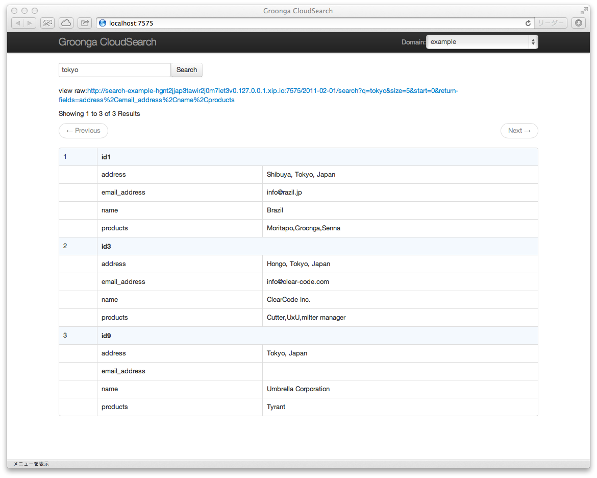

# Tutorial

This document describes how to use Groonga CloudSearch step by
step. The goal of this document is that you understand how to use
Amazon CloudSearch compatible API and you can develop your application
with Groonga CloudSearch. You don't need Amazon CloudSearch API
related knowledge. This document describes it.

This document doesn't describe Amazon CloudSearch specific items such
as how to start Amazon CloudSearch service and how much payment will
be caused for your application. See [Amazon CloudSearch
page](http://aws.amazon.com/cloudsearch/) about them.

## Summary

Groonga CloudSearch is an Amazon CloudSearch compatible open source
full text search service. Groonga CloudSearch provides Amazon
CloudSearch compatible API. You don't need to pay any fee, register
any sites and buy a new server to use Groonga CloudSearch.  You can
try Amazon CloudSearch compatible API on your computer and develop
your application that uses Amazon CloudSearch API.

You will get your Amazon CloudSearch API on your computer after
this tutorial.

This tutorial describes [how to search
documents](#how-to-search-documents) and [how to register
documents](#how-to-register-documents). First, searching is described
because you will be interested in searching rather than registering.

Searching is described with example documents provided by Groonga
CloudSearch. So you don't need to care about registering. It is
described later.

## Prepare test environment

This section describes how to prepare your environment to do this
tutorial. In this tutorial, Mac OS X is used but you can also use
Ubuntu 12.04 LTS or CentOS 6.

### Install Groonga CloudSearch

Install Groonga CloudSearch. [Install](../install/) describes how to
install Groonga CloudSearch.

Type the following command to confirm Groonga CloudSearch is installed
successfully:

    $ gcs --version
    1.0.0

### Register `example` search domain

Amazon CloudSearch API groups search target documents. Each group is
searched separately. The group is called as `search domain`. `Search
domain` is corresponding table in RDBMS. A `search domain` has
documents like a table in RDBMS has records.

See also: [`search domain` in Amazon CloudSearch
Glossary - Amazon CloudSearch](http://docs.amazonwebservices.com/cloudsearch/latest/developerguide/Glossary.html#searchdomain)

In this tutorial, `example` is used as the sample search domain name.

Amazon CloudSearch API requires two endpoints per search domain. Here
are endpoint host name formats:

* `search-DOMAIN_NAME-DOMAIN_ID.us-east-1.cloudsearch.amazonaws.com`
* `doc-DOMAIN_NAME-DOMAIN_ID.us-east-1.cloudsearch.amazonaws.com`

`DOMAIN_NAME` is search domain name. `DOMAIN_ID` is search domain ID.

See also: [Endpoints for Amazon CloudSearch - Amazon
CloudSearch](http://docs.amazonwebservices.com/cloudsearch/latest/developerguide/endpoints.html)

Groonga CloudSearch uses the following endpoint host name formats:

 * `search-DOMAIN_NAME-00000000000000000000000000.localhost`
 * `doc-DOMAIN_NAME-00000000000000000000000000.localhost`

`DOMAIN_NAME` is search domain name. Search domain ID is always
`00000000000000000000000000` for now. It'll be replaced unique ID in
the future release.

To access local Groonga CloudSearch service by those endpoint host
names, you need to resolve those endpoint host names as
`127.0.0.1`. Run the following command to register those endpoint host
names to your `/etc/hosts`:

    $ sudo gcs-register-hosts example

Type the following command to confirm endpoint host names can be
resolved:

    $ ping -c 1 search-example-00000000000000000000000000.localhost
    PING search-example-00000000000000000000000000.localhost (127.0.0.1) 56(84) bytes of data.
    64 bytes from localhost (127.0.0.1): icmp_req=1 ttl=64 time=0.030 ms
    ...
    $ ping -c 1 doc-example-00000000000000000000000000.localhost
    PING doc-example-00000000000000000000000000.localhost (127.0.0.1) 56(84) bytes of data.
    64 bytes from localhost (127.0.0.1): icmp_req=1 ttl=64 time=0.020 ms
    ...

### Start Groonga CloudSearch service

Run Groonga CloudSearch service by `gcs` command:

    $ gcs

Groonga CloudSearch service listens at
[http://localhost:7575/](http://localhost:7575/) by default.

### Import example documents

Import example documents for simple search API by
`gcs-import-examples` command because search API is described before
document registration API. Use another terminal and execute the following
command:

    $ gcs-import-examples

If you see

Hit enter to start importing.

If you need some action before start importing, you will see the instructions like the screenshot below. Follow the instructions and run `gcs-import-examples` again.

When you hit the enter key, import will be started.

OK. Test environment is prepared. Let's try search API.

## How to search documents {#how-to-search-documents}

Simple search API is used for searching documents. Groonga CloudSearch
also provides dashboard Web page at
[http://localhost:7575/](http://localhost:7575/).

Open [http://localhost:7575/](http://localhost:7575/) to try simple
search API. Input `tokyo` to text field and press `Search` button! You
will get documents that have `tokyo` keyword in content.

There is the API URL corresponding to the query in the search page.
To see raw response body in JSON, open the API URL.

The API URL just has `q` parameter. `q` parameter means that searching
documents that have query string (`q` parameter value) in the default
search fields. The default search fields are all text fields by
default.

See also: [Searching the Default Search Field in Amazon CloudSearch -
Amazon
CloudSearch](http://docs.amazonwebservices.com/cloudsearch/latest/developerguide/simplesearches.html)

See [Search Response - Amazon
CloudSearch](http://docs.amazonwebservices.com/cloudsearch/latest/developerguide/Search.Response.html)
for returned JSON format.

### Restrictions

Groonga CloudSearch only supports `q` parameter for now. Other
parameters such as `start` and `size` will be supported in the future
release.

See also: [Search Requests - Amazon
CloudSearch](http://docs.amazonwebservices.com/cloudsearch/latest/developerguide/Search.Requests.html)
for all parameters.

## How to register documents {#how-to-register-documents}

The above section describes how to search documents. The below
sections describe how to register your documents.

### Configuration API

You need to create search domain and text fields before registering
documents. Configuration API is used for them. This section describes
how to create a search domain.

Configuration API is for creating, configuring and managing search
domains. Configuration API requires `Action` parameter and `Version`
parameter. `Version` parameter must be `2011-02-01` for all
configuration API.

See also: [Amazon CloudSearch Configuration API Reference - Amazon
CloudSearch](http://docs.amazonwebservices.com/cloudsearch/latest/developerguide/ConfigAPI.html).

Configuration API requires authentication but Groonga CloudSearch
doesn't implement it yet. You can omit authentication related
parameters.

See also: [Request Authentication - Amazon
CloudSearch](http://docs.amazonwebservices.com/cloudsearch/latest/developerguide/requestauth.html)
for details.

### Creating search domain API

To create a new search domain, `CreateDomain` is specified as `Action`
parameter. `CreateDomain` action requires `DomainName` parameter. Its
value must be a new search domain name to be created.

Here is an API request to create `address` search domain:

    $ curl -s "http://localhost:7575/?DomainName=address&Action=CreateDomain&Version=2011-02-01"

See also: [CreateDomain - Amazon
CloudSearch](http://docs.amazonwebservices.com/cloudsearch/latest/developerguide/API_CreateDomain.html)
for details.

### Registering endpoint host names

To access the created search domain, you need to endpoint host names
such as:

 * `search-DOMAIN_NAME-00000000000000000000000000.localhost`
 * `doc-DOMAIN_NAME-00000000000000000000000000.localhost`

You can use `gcs-register-hosts` command to register those host names
to `/etc/hosts` as you saw in [how to search
documents](#how-to-search-documents) section.

Here is a command to register endpoint host names for `address` search
domain:

    $ sudo gcs-register-hosts address

Type the following command to confirm endpoint host names can be
resolved:

    $ ping -c 1 search-address-00000000000000000000000000.localhost
    PING search-address-00000000000000000000000000.localhost (127.0.0.1) 56(84) bytes of data.
    64 bytes from localhost (127.0.0.1): icmp_req=1 ttl=64 time=0.030 ms
    ...
    $ ping -c 1 doc-address-00000000000000000000000000.localhost
    PING doc-address-00000000000000000000000000.localhost (127.0.0.1) 56(84) bytes of data.
    64 bytes from localhost (127.0.0.1): icmp_req=1 ttl=64 time=0.020 ms
    ...

### Defining index field API

To define a new index field for the search domain, `DefineIndexField`
is specified as `Action` parameter. `DefineIndexField` action requires
`DomainName` parameter and `IndexField.IndexFieldName`
parameter. `DomainName` parameter value must be the target search
domain name. `IndexField.IndexFieldName` value must be a new index
field name to be defined.

Here is an API request to define `name` index field to `address`
search domain:

    $ curl -s "http://localhost:7575/?Action=DefineIndexField&DomainName=address&IndexField.IndexFieldName=name&Version=2011-02-01"

See also: [DefineIndexField - Amazon
CloudSearch](http://docs.amazonwebservices.com/cloudsearch/latest/developerguide/API_DefineIndexField.html)
for details.

### Registering documents API

To register documents, Document Service API is used. Here is endpoint
host name format of Document Service API on Groonga CloudSearch:

 * `doc-DOMAIN_NAME-00000000000000000000000000.localhost`

Post documents in SDF JSON representation to the endpoint. SDF is
acronym of Search Data Format. Here is a sample SDF JSON
representation:

    [
      {
        "type": "add",
        "id": "id1",
        "version": 1,
        "lang": "en",
        "fields": {
          "name": "Brazil"
        }
      },
      {
        "type": "add",
        "id": "id2",
        "version": 1,
        "lang": "en",
        "fields": {
          "name": "Enishi Tech Inc."
        }
      }
    ]

See also: [documents/batch JSON API - Amazon
CloudSearch](http://docs.amazonwebservices.com/cloudsearch/latest/developerguide/DocumentsBatch.JSON.html)
for details of SDF JSON representation.

Here is an API request to register documents that are stored in
`addresses.sdf.json` to `address` search domain:

    $ curl -X POST --upload-file addresses.sdf.json --header "Content-Type: application/json" http://doc-address-00000000000000000000000000.localhost:7575/2011-02-01/documents/batch

See also: [documents/batch JSON API - Amazon
CloudSearch](http://docs.amazonwebservices.com/cloudsearch/latest/developerguide/DocumentsBatch.JSON.html#DocumentsBatch.JSON.ResponseProperties)
for details of response.

Now, you can search registered documents! Yay!

## Next step

Join our [Community](/community/) and share your requests, problems
and so on!
