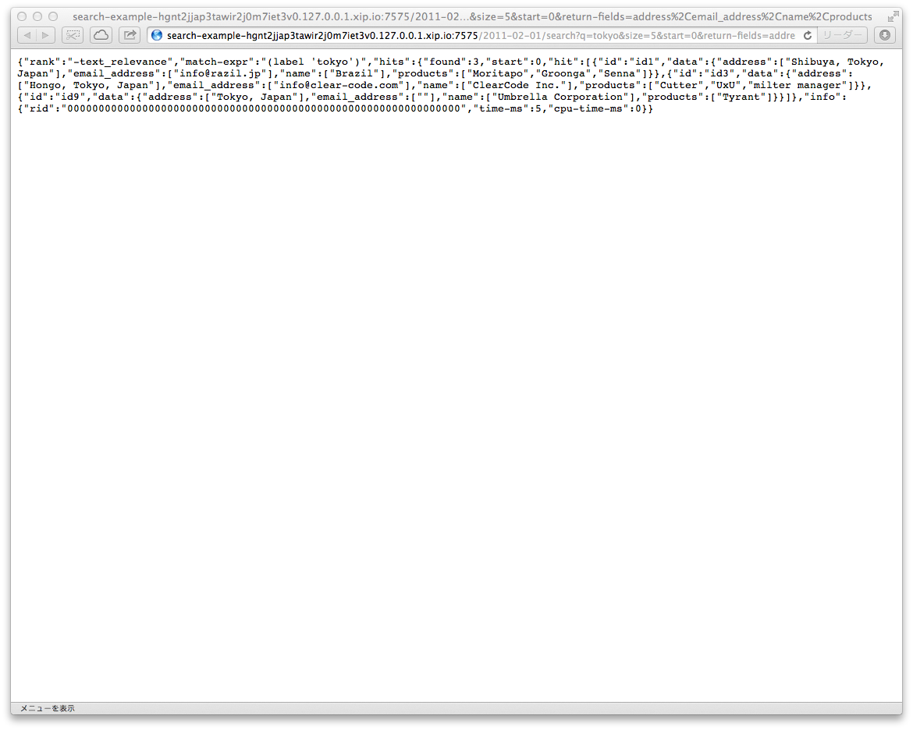

# Tutorial

This document describes how to use Groonga CloudSearch step by
step. It's the goal of this document that you understand how to use
Amazon CloudSearch compatible API and you can develop your application
with Groonga CloudSearch. You don't need Amazon CloudSearch API
related knowledge. This document describes it.

This document doesn't describe Amazon CloudSearch specific items such
as how to start Amazon CloudSearch service and how much payment will
be caused for your application. See [Amazon CloudSearch
page](http://aws.amazon.com/cloudsearch/) about them.

## Summary

Groonga CloudSearch is an Amazon CloudSearch compatible open source
full text search service. Groonga CloudSearch provides Amazon
CloudSearch compatible API. You don't need to pay any fee, register
any sites and buy a new server to use Groonga CloudSearch.  You can
try Amazon CloudSearch compatible API on your computer and develop
your application that uses Aamazon CloudSearch API.

You will get your Amazon CloudSearch API on your computer after
this tutorial.

This tutorial describes only three important APIs:

1. Simple search API
2. Creating search domain API
3. Creating text field API

The simple search API is described with sample data provided by
Groonga CloudSearch. So you don't need to care about _search domain_
and _text field_. They are described later.

## Prepare test environment

This section describes how to parepare your environment to do this
tutorial. In this tutorial, Mac OS X is used but you can also use
Ubuntu 12.04 LTS or CentOS 6.

### Install Groonga CloudSearch

Install Groonga CloudSearch. [Install](../install/) describes how to
install Groonga CloudSearch.

Type the following command to confirm Groonga CloudSearch is installed
successfully:

    $ gcs --version
    1.0.0

### Register `example` search domain

Amazon CloudSearch API groups search target documents. Each group is
searched separately. The group is called as `search domain`. `Search
domain` is corresponding table in RDBMS. A `search domain` has
documents like a table in RDBMS has records.

See also: [`search domain` in Amazon CloudSearch
Glossary](http://docs.amazonwebservices.com/cloudsearch/latest/developerguide/Glossary.html#searchdomain)

In this tutorial, `example` is used as the sample search domain name.

Amazon CloudSearch API requires two endpoints per search domain. Here
are endpoint host name formats:

* `search-DOMAIN_NAME-DOMAIN_ID.us-east-1.cloudsearch.amazonaws.com`
* `doc-DOMAIN_NAME-DOMAIN_ID.us-east-1.cloudsearch.amazonaws.com`

`DOMAIN_NAME` is search domain name. `DOMAIN_ID` is search domain ID.

See also: [Endpoints for Amazon
CloudSearch](http://docs.amazonwebservices.com/cloudsearch/latest/developerguide/endpoints.html)

Groonga CloudSearch uses the following endpoint host name formats:

* `search-DOMAIN_NAME-00000000000000000000000000.localhost`
* `doc-DOMAIN_NAME-00000000000000000000000000.localhost`

`DOMAIN_NAME` is search domain name. Search domain ID is always
`00000000000000000000000000` for now. It'll be replaced unique ID in
the future release.

To access local Groonga CloudSearch service by those endpoint host
names, you need to resolve those endpoint host names as
`127.0.0.1`. Run the following command to register those endpoint host
names to your `/etc/hosts`:

    $ sudo gcs-register-hosts example

Type the following command to confirm endpoint host names can be
resolved:

    $ host search-example-00000000000000000000000000.localhost
    $ host doc-example-00000000000000000000000000.localhost

...HERE...

Install Groonga Cloudsearch following [install instructions](../install/).

## Setup /etc/hosts

Groonga CloudSearch requires name-based virtualhosts configured. These commands will add configurations to the domain "example". Run these commands on the terminal:

    $ sudo sh -c 'echo "127.0.0.1 doc-example-00000000000000000000000000.localhost" >> /etc/hosts'
    $ sudo sh -c 'echo "127.0.0.1 search-example-00000000000000000000000000.localhost" >> /etc/hosts'

Note: A _domain_ encapsulates the data and search instances. See [Amazon CloudSearch Glossary - Amazon CloudSearch](http://docs.amazonwebservices.com/cloudsearch/latest/developerguide/Glossary.html#searchdomain) for details.

## Start GCS server

You need to start GCS server. Run gcs command:

    $ gcs

GCS server will listen at http://127.0.0.1:3000/.

## Import example data

You can import example data into GCS with gcs-import-examples command. Use another terminal and execute the following command:

    $ gcs-import-examples

Hit enter to start importing.

## Search documents

Now you can search the documents. Open http://127.0.0.1:3000/ with your browser.
 Try 'tokyo' as a query.

Now you can see the URL corresponding the query on the web interfece.
When opened, you will see the response body.

## Next step

To learn how to index the documents, [the source code of gcs-import-examples](https://github.com/groonga/gcs/blob/master/bin/gcs-import-examples) will help you.
